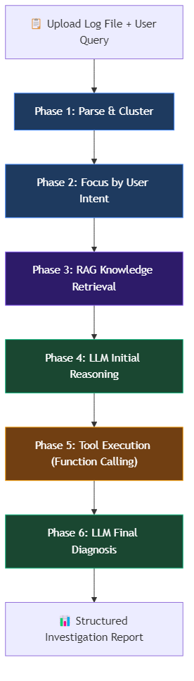
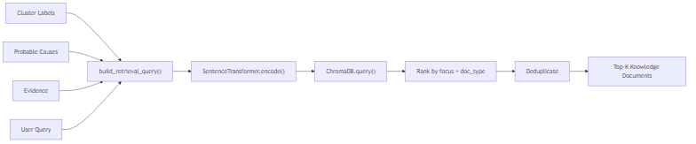
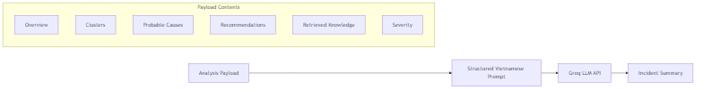
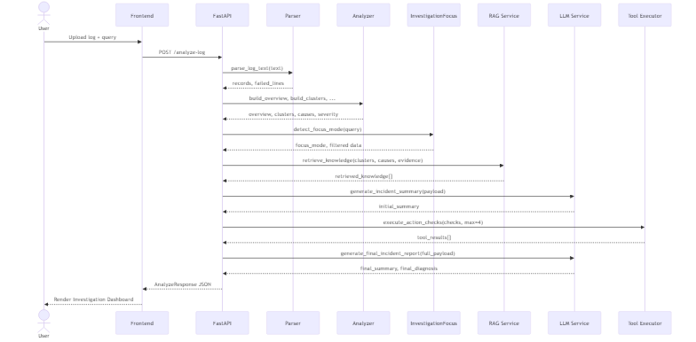

# 🤖 AI Agent Pipeline Design

## Tổng quan

AI Agent hoạt động theo mô hình **6-phase pipeline**, mỗi phase đảm nhận một bước trong quy trình điều tra sự cố. Agent kết hợp **rule-based analysis**, **RAG retrieval**, **LLM reasoning**, và **tool execution (function calling)**.

---

## Pipeline Flow

---

## Chi tiết từng Phase

### Phase 1 — Parse & Cluster
**Module:** `parser.py` + `analyzer.py`

**Xử lý:**
- Parse log bằng regex pattern cho Apache error log format
- Normalize level (notice→INFO, crit→ERROR)
- Infer service từ message (mod_jk, workerEnv, jk2_init, client_request, apache)
- Cluster WARN/ERROR theo rule-based classification → 8 loại lỗi
- Derive nguyên nhân, recommendations, severity, evidence, action checks

---

### Phase 2 — Focus by User Intent
**Module:** `investigation_focus.py`

**Xử lý:**
- Phân tích user query bằng keyword matching → xác định focus mode
- Reorder clusters: primary issues lên đầu, secondary xuống dưới
- Filter causes, recommendations, action checks theo focus mode
- Annotate primary issue vs secondary issues

---

### Phase 3 — RAG Knowledge Retrieval
**Module:** `rag_service.py`

**Xử lý:**
- Build semantic query từ clusters + causes + evidence + user query
- Encode bằng `all-MiniLM-L6-v2`
- Query ChromaDB, lấy `top_k * 4` results
- Filter theo focus mode (drop access docs khi focus backend, ngược lại)
- Rank theo: focus relevance → doc_type (runbook > text_note > official_docs) → source
- Deduplicate và trả về top-K

---

### Phase 4 — LLM Initial Reasoning
**Module:** `llm_service.py` → `generate_incident_summary()`

**Prompt Strategy:**
- System: "Bạn là trợ lý phân tích log Apache"
- Format cứng: 4 dòng (Tổng quan / Lỗi chính / Nguyên nhân khả dĩ / Hành động ưu tiên)
- Constraint: bám sát user_query, ưu tiên retrieved_knowledge, không bịa
- Fallback: khi không có API key → trả summary tĩnh hardcoded

---

### Phase 5 — Tool Execution (Function Calling)
**Module:** `tool_executor.py`

**Available Tools:**

| Tool | Mục đích | Security |
|------|---------|----------|
| `check_http_endpoint` | Kiểm tra backend HTTP có phản hồi không | Mock in demo |
| `check_tcp_port` | Kiểm tra cổng TCP (AJP 8009) có mở không | Real socket check |
| `read_file` | Đọc file cấu hình (workers2.properties) | Path sandbox |
| `read_file_tail` | Đọc N dòng cuối log (mod_jk.log) | Path sandbox |
| `run_shell_command` | Chạy command hệ thống (netstat, ps) | Command allowlist |

**Security:**
- File read: chỉ cho phép trong `data/` directory
- Shell command: chỉ cho phép prefix trong allowlist
- Platform check: skip tool nếu OS không tương thích

---

### Phase 6 — LLM Final Diagnosis
**Module:** `llm_service.py` → `generate_final_incident_report()`

**Prompt Strategy:**
- Input: tất cả data từ Phase 1–5 + tool results
- Output format cứng: `FINAL_SUMMARY:` + `FINAL_DIAGNOSIS:` (– bullets)
- Constraint: dùng tool_results cập nhật kết luận, phân biệt issue chính/phụ
- Ngôn ngữ thận trọng: "nhiều khả năng", "cho thấy", "phù hợp với tình huống"

---

## Data Flow Summary

