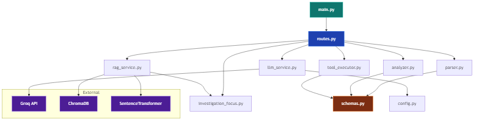

# 📦 Class & Module Diagram

## Backend Module Structure

```
app/
├── main.py                  # FastAPI app entry point
├── api/
│   └── routes.py            # HTTP endpoints, pipeline orchestration
├── core/
│   └── config.py            # Settings (GROQ_API_KEY, MODEL_NAME)
├── models/
│   └── schemas.py           # Pydantic data models
├── services/
│   ├── parser.py            # Log text parsing
│   ├── analyzer.py          # Analysis engine (clusters, causes, severity)
│   ├── investigation_focus.py  # User intent detection & filtering
│   ├── rag_service.py       # RAG knowledge retrieval
│   ├── llm_service.py       # LLM API calls (Groq)
│   └── tool_executor.py     # Tool execution engine
└── utils/
    └── helpers.py           # Utility functions
```

---

## Class Diagram


---

## Module Dependency Graph



---

## Key Functions per Module

### `parser.py`
| Function | Input | Output |
|----------|-------|--------|
| `parse_log_text(text)` | Raw log string | `(List[LogRecord], List[str])` |
| `normalize_level(level)` | Raw level string | Normalized level |
| `infer_service_from_message(msg)` | Log message | Service name |

### `analyzer.py`
| Function | Input | Output |
|----------|-------|--------|
| `build_overview(records, failed)` | Parsed records | `Overview` |
| `build_clusters(records)` | Parsed records | `List[ErrorCluster]` |
| `derive_probable_causes(clusters)` | Clusters | `List[str]` |
| `derive_recommendations(clusters)` | Clusters | `List[str]` |
| `derive_severity(clusters)` | Clusters | `"LOW"/"MEDIUM"/"HIGH"` |
| `collect_evidence(clusters)` | Clusters | `List[str]` (max 6) |
| `derive_action_checks(clusters)` | Clusters | `List[dict]` |

### `investigation_focus.py`
| Function | Input | Output |
|----------|-------|--------|
| `detect_focus_mode(query)` | User query | `"general"/"backend_connectivity"/"access_control"` |
| `filter_clusters_by_focus(clusters, mode)` | Clusters + mode | Reordered clusters |
| `filter_list_by_focus(items, mode)` | String list + mode | Filtered list |
| `annotate_issue_roles(clusters, mode)` | Clusters + mode | `(primary, secondaries)` |

### `rag_service.py`
| Function | Input | Output |
|----------|-------|--------|
| `build_retrieval_query(labels, causes, evidence, query)` | Analysis context | Semantic query string |
| `retrieve_knowledge(labels, causes, evidence, query, top_k)` | Analysis context | `List[str]` formatted KB docs |

### `llm_service.py`
| Function | Input | Output |
|----------|-------|--------|
| `generate_incident_summary(payload)` | Full analysis payload | Summary string |
| `generate_final_incident_report(payload)` | Payload + tool results | `(summary, List[diagnosis])` |

### `tool_executor.py`
| Function | Input | Output |
|----------|-------|--------|
| `check_http_endpoint(url, timeout)` | URL | `{"reachable": bool, "detail": str}` |
| `check_tcp_port(host, port, timeout)` | Host + port | `{"reachable": bool, "detail": str}` |
| `read_file(path)` | File path | `{"ok": bool, "content": str}` |
| `read_file_tail(path, lines)` | File path + N | `{"ok": bool, "content": str}` |
| `run_shell_command(command)` | Shell command | `{"ok": bool, "output": str}` |
| `execute_action_checks(checks, max)` | Action list | `List[ToolExecutionResult]` |
